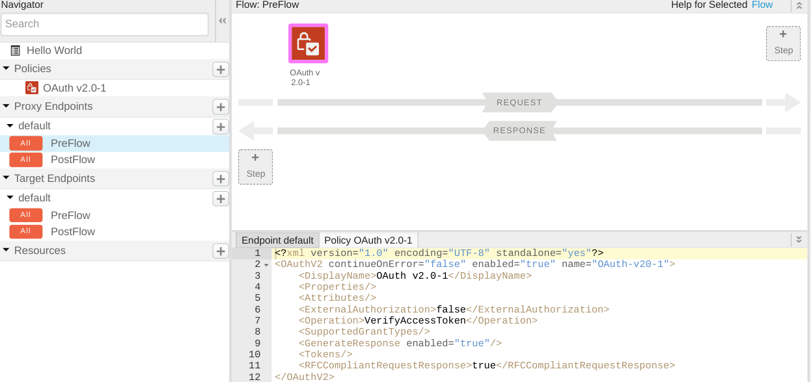
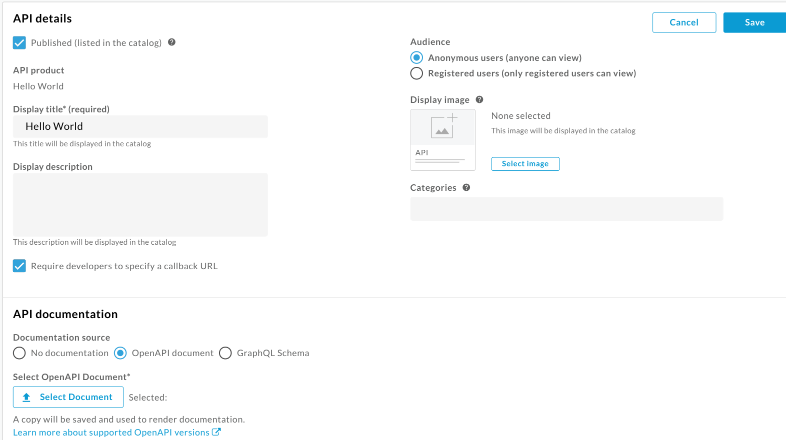

# 3-legged-oauth-okta
Implement 3-legged OAuth on Apigee using Okta as an IDP

## Intro

Welcome to this lab on using Okta to implement a 3-legged OAuth flow in Apigee

We will piggyback off the devrel[idp-okta-integration](https://github.com/apigee/devrel/tree/main/labs/idp-okta-integration) lab, and extend it. The devrel lab gets the OAuth flow working via curl commands and copy/paste. This lab is meant to take it a step further and get it working in the developer portal and in a client application. By the end of this lab you should be able to understand 3-legged OAuth and how to apply it in production environments.

Lets get started!

## Prereqs

Complete the [devrel okta lab](https://github.com/apigee/devrel/tree/main/labs/idp-okta-integration). We'll be picking up where this leaves off.

## But first...

In the devrel lab section "Use Identity Facade with API Proxy" you were able to send your OAuth token to the default Apigee hello-world proxy. However, the lab seems to have forgotten to tell you to add an OAuthV2 policy to verify the token. Let's do that now.

1. In the Apigee portal, go to Develop > API Proxies > hello-world > Develop
2. Under Proxy Endpoints click PreFlow. Then, click the "+ Step" button in the preflow.
3. Add the policy called "OAuth v2.0-1". No changes are needed to it.

4. Go back through the devrel steps [here](https://github.com/apigee/devrel/tree/main/labs/idp-okta-integration#use-identity-facade-with-api-proxy) to test the proxy auth. You should be able to start at step 8 if you'd gone through the lab before.

## Developer Portal

### Create the developer portal

1. Go to Publish > Portals
2. Create a new portal. You could name it "hello-world" if you'd like.
3. Next, let's add an API to it. Go to APIs > + to add a new API. Select the hello-world product you created in the devrel lab
4. Update the hello-world product to be Published (listed in the catalog), and Require developers to specifify a callback URL.
5. Next in the hello-world product upload API documentation in the form of an OpenAPI document. Use the yaml from this repository > apigee/helloWorldApiSpec.yaml. You'll have to replace every mention of "{environment_group_hostname}" with you Apigee Group hostname (Admin > Environments > Groups)

6. Update the Hello World App to use a callback URL. Define it as https://{developer_portal_host}/oauth_redirect. You can get developer_portal_host by going to the hello-world product and clicking "Live Portal"

### Update the oauth proxy

the Okta OAuth identity facade proxies as given by Drevel don't work with the developer portal out of the box. We'll go through together and make some updates to the proxies.

1. Navigate to the identity facade proxy. Go the the develop tab.
2. In the /authorize flow, we'll want to remove a couple of unneeded conditional steps. The steps to delete or comment out are as follows: RF-InvalidRequest-Redirect, RF-InvalidRequest-Redirect, RF-InvalidRequest-Redirect
3. We'll also need to add a CORS policy for preflight requests. Add the OptionsPreFlight Flow from Apigee Documentation [here](https://docs.apigee.com/api-platform/develop/adding-cors-support-api-proxy#handlingcorspreflightrequests). This will also require you to create a new AssignMessage policy called "add-cors". You can replace the policy definition with what's in /apigee/identity-facade-v1/policies/add-cors.xml.
4. You'll also want to add a CORS policy on the response PostFlow. Reuse the Add CORS policy from step 3. See Apigee Documentation [here](https://docs.apigee.com/api-platform/develop/adding-cors-support-api-proxy#attachinganaddcorspolicytoanewapiproxy 
5. Repeat steps 3 and 4 with you hello-world proxy
6. Be sure to save and deploy all changes

### Test the portal

1. Navigate to your Live Developer Portal (Publish > Portals > Hello World > Live Portal)
2. Create an account
3. Sign in
4. Navigate to your hello-world api
5. Click the authorize button. For clientId and clientSecret use the values provided in the drevel lab via Okta
6. Test the hello-world API

## Client Application

Update identiy facade to remove RF-InvalidRequest step in /authorize
This might not have been necessary ^. I thinik I have to create a new app